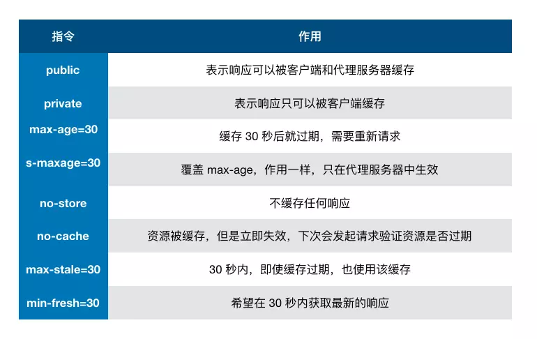

## js面试题的一些笔记


##### 关于+运算

```javascript
'a' + + 'b' // -> "aNaN"
```
因为+ 'b'等于NaN，所以结果为"aNaN"


##### 深拷贝

###### 利用JSON.parse(JSON.stringify(object))的弊端

- 会忽略 undefined
- 会忽略 symbol
- 不能序列化函数
- 不能解决循环引用的对象

##### 原型原型链

```
function foo() {}
let f1 = new foo();
console.log(f1.constructor === foo); // true
console.log(foo.prototype === f1.__proto__);//true
```

##### 变量提升

函数的提升先于变量的提升

#### 继承

##### 组合继承
```
function Parent(value) {
  this.val = value
}
Parent.prototype.getValue = function() {
  console.log(this.val)
}
function Child(value) {
  Parent.call(this, value)
}
Child.prototype = new Parent()

const child = new Child(1)

child.getValue() // 1
child instanceof Parent // true

```

这里通过call使得在即将创建的Child的实例的环境下（即child）调用了Parent构造函数，就会在所有的Child对象上执行Parent函数中定义的代码，就能实现将Parent的属性继承到child上了。然后通过改变子类的prototype对象来继承父类的函数。
缺点是导致子类上多了不需要的父类属性。

##### 寄生组合继承

```
function Parent(value) {
  this.val = value
}
Parent.prototype.getValue = function() {
  console.log(this.val)
}

function Child(value) {
  Parent.call(this, value)
}
Child.prototype = Object.create(Parent.prototype, {
  constructor: {
    value: Child,
    enumerable: false,
    writable: true,
    configurable: true
  }
})

const child = new Child(1)

child.getValue() // 1
child instanceof Parent // true
```
组合继承在继承父类的方法的时候调用了构造函数，而寄生组合继承优化了这一点。
###### Object.create
Object.create创建一个新对象，使用现有的对象来提供新创建的对象的__proto__。 
第一个参数就是要作为__proto__的对象。第二个参数为要添加到新创建对象上的可枚举属性。

而例子中就是把Parent的prototype作为Child.prototype.__ proto __，即让Child来继承Parent。再给其添加构造函数方法，即Child函数。

###### class

```
class Parent {
  constructor(value) {
    this.val = value
  }
  getValue() {
    console.log(this.val)
  }
}
class Child extends Parent {
  constructor(value) {
    super(value)
  }
}
let child = new Child(1)
child.getValue() // 1
child instanceof Parent // true
```
class利用extends来进行继承，super()相当于Parent.call(this)。

class的本质是构造函数的语法糖。


##### es6的proxy


#### 回调函数

回调函数就是一个通过函数指针调用的函数。如果你把函数的指针（地址）作为参数传递给另一个函数，当这个指针被用来调用其所指向的函数时，我们就说这是回调函数。回调函数不是由该函数的实现方直接调用，而是在特定的事件或条件发生时由另外的一方调用的，用于对该事件或条件进行响应。

#### 常用定时器函数（setTimeout,setInterval,requestAnimationFrame)

##### 避免setTimeout不能按期执行

在执行前代码记录时间，在执行完后，下一次循环的时间就是传入的时间减去执行代码消耗的时间。

#### instance of的原理

通过判断对象的原型链中是否能找到类型的prototype。


#### 垃圾回收机制

##### 新生代算法
新生代算法中的对象中一般存活时间比较短。在新生代空间中，内存空间被分为两部分，from和to，这两个中必定有一个是使用的，一个是空闲的，新分配的对象会被放入from空间，当from空间占满的时候，就会启动gc算法，算法会检查from空间中存活的对象并且移动到to空间中，有失活的对象就销毁。当复制完成后，将from空间和to空间互换。

##### 老生代算法

老生代中的对象一般存活时间较长且数量也多，使用了两个算法，分别是标记清除算法和标记压缩算法。

在讲算法前，先来说下什么情况下对象会出现在老生代空间中：

- 新生代中的对象是否已经经历过一次 Scavenge 算法，如果经历过的话，会将对象从新生代空间移到老生代空间中。
- To 空间的对象占比大小超过 25 %。在这种情况下，为了不影响到内存分配，会将对象从新生代空间移到老生代空间中。

老生代中的空间很复杂，有如下几个空间
```
enum AllocationSpace {
  // TODO(v8:7464): Actually map this space's memory as read-only.
  RO_SPACE,    // 不变的对象空间
  NEW_SPACE,   // 新生代用于 GC 复制算法的空间
  OLD_SPACE,   // 老生代常驻对象空间
  CODE_SPACE,  // 老生代代码对象空间
  MAP_SPACE,   // 老生代 map 对象
  LO_SPACE,    // 老生代大空间对象
  NEW_LO_SPACE,  // 新生代大空间对象

  FIRST_SPACE = RO_SPACE,
  LAST_SPACE = NEW_LO_SPACE,
  FIRST_GROWABLE_PAGED_SPACE = OLD_SPACE,
  LAST_GROWABLE_PAGED_SPACE = MAP_SPACE
};
```

在老生代中，以下情况会先启动标记清除算法：

- 某一个空间没有分块的时候
- 空间中被对象超过一定限制
- 空间不能保证新生代中的对象移动到老生代中

在这个阶段中，会遍历堆中的所有的对象，然后标记活的对象，在标记完成以后销毁所有没被标记的对象。这是标记清除法。

清除对象后会造成堆内存出现碎片的情况，当碎片超过一定的限制后会启动压缩算法。压缩过程中，将活的对象像一端移动，直到所有对象都移动完成然后清理掉不需要的内存。

#### 事件机制（事件触发的过程是怎么样的？知道什么是事件代理吗？）

##### 事件触发三阶段

1. window往事件触发处传播，遇到注册的捕获事件会触发
2. 传播到事件触发处时触发注册的事件
3. 从事件触发处往window传播，遇到注册的冒泡事件会触发

如果给body中的子节点添加冒泡事件和捕获事件，会按照注册的顺序执行。

##### 注册事件
addEventListener注册事件的第三个参数可以是布尔值或者对象。对于布尔值来说就是useCapture，默认为false，这决定了注册的事件是捕获事件还是冒泡事件。对于对象参数来说，有以下几个属性：

- capture：布尔值，和 useCapture 作用一样
- once：布尔值，值为 true 表示该回调只会调用一次，调用后会移除监听
- passive：布尔值，表示永远不会调用 preventDefault

##### 事件代理
给父元素绑定点击事件，然后使用event.target获取目标元素。

#### 跨域

如果协议，域名和端口有一个不同就会出现跨域问题。

为了防止csrf攻击，csrf攻击就是利用用户的登录态发起恶意请求。

跨域是拦截了响应，而不是拦截请求，请求其实是发出去了的。

#### 跨域解决方案

##### jsonp

jsonp的原理是利用script标签没有跨域限制的漏洞。通过script标签指向一个需要访问的地址并提供一个回调函数来接受数据当需要通讯时。jsonp使用简单且兼容性不错，但是只限于get请求。

##### CORS（跨域资源共享）

CORS 需要浏览器和后端同时支持。IE 8 和 9 需要通过 XDomainRequest 来实现。

浏览器会自动进行 CORS 通信，实现 CORS 通信的关键是后端。只要后端实现了 CORS，就实现了跨域。

服务端设置 Access-Control-Allow-Origin 就可以开启 CORS。 该属性表示哪些域名可以访问资源，如果设置通配符则表示所有网站都可以访问资源。

虽然设置 CORS 和前端没什么关系，但是通过这种方式解决跨域问题的话，会在发送请求时出现两种情况，分别为简单请求和复杂请求。

###### 简单请求
以 Ajax 为例，当满足以下条件时，会触发简单请求

1. 使用下列方法之一：

- GET

- HEAD

- POST

2. Content-Type 的值仅限于下列三者之一：

- text/plain

- multipart/form-data

- application/x-www-form-urlencoded

请求中的任意 XMLHttpRequestUpload 对象均没有注册任何事件监听器； XMLHttpRequestUpload 对象可以使用 XMLHttpRequest.upload 属性访问。

###### 复杂请求

那么很显然，不符合以上条件的请求就肯定是复杂请求了。

对于复杂请求来说，首先会发起一个预检请求，该请求是 option 方法的，通过该请求来知道服务端是否允许跨域请求。

对于预检请求来说，如果你使用过 Node 来设置 CORS 的话，可能会遇到过这么一个坑。

以下以 express 框架举例：

```
app.use((req, res, next) => {
  res.header('Access-Control-Allow-Origin', '*')
  res.header('Access-Control-Allow-Methods', 'PUT, GET, POST, DELETE, OPTIONS')
  res.header(
    'Access-Control-Allow-Headers',
    'Origin, X-Requested-With, Content-Type, Accept, Authorization, Access-Control-Allow-Credentials'
  )
  next()
})
```

该请求会验证你的 Authorization 字段，没有的话就会报错。

当前端发起了复杂请求后，你会发现就算你代码是正确的，返回结果也永远是报错的。因为预检请求也会进入回调中，也会触发 next 方法，因为预检请求并不包含 Authorization 字段，所以服务端会报错。

想解决这个问题很简单，只需要在回调中过滤 option 方法即可

```
res.statusCode = 204
res.setHeader('Content-Length', '0')
res.end()
```

##### document.domain

如果二级域名相同，就可以给页面添加document.domain 表示二级域名相同实现跨域。

##### postMessage

这种方式通常用于获取嵌入页面中的第三方页面数据。一个页面发送消息，另一个页面判断来源并接收消息；

```
// 发送消息端
window.parent.postMessage('message', 'http://test.com')
// 接收消息端
var mc = new MessageChannel()
mc.addEventListener('message', event => {
  var origin = event.origin || event.originalEvent.origin
  if (origin === 'http://test.com') {
    console.log('验证通过')
  }
})
```

#### 浏览器存储功能

cookie localStorage sessionStorage indexDB


特性 | cookie | localStorage | sessionStorage | indexDB
---|---|---|---|---
数据生命周期	 | 一般由服务器生成，可以设置过期时间 |	除非被清理，否则一直存在	 | 页面关闭就清理 | 	除非被清理，否则一直存在
数据存储大小	 | 4K | 5M | 	5M |	无限
与服务端通信 | 	每次都会携带在 header 中，对于请求性能影响 | 	不参与 | 不参与 | 不参与

对于cookie来说，还有几个安全性相关的属性：

属性 | 作用
---|---
value | 如果用于保存用户登录态，应该将该值加密，不能使用明文的用户标识
http-only | 不能通过 JS 访问 Cookie，减少 XSS 攻击
secure | 只能在协议为 HTTPS 的请求中携带
same-site | 规定浏览器不能在跨域请求中携带 Cookie，减少 CSRF 攻击

##### Service Worker

Service Worker 是运行在浏览器背后的独立线程，一般可以用来实现缓存功能。使用 Service Worker的话，传输协议必须为 HTTPS。因为 Service Worker 中涉及到请求拦截，所以必须使用 HTTPS 协议来保障安全。

Service Worker 实现缓存功能一般分为三个步骤：首先需要先注册 Service Worker，然后监听到 install 事件以后就可以缓存需要的文件，那么在下次用户访问的时候就可以通过拦截请求的方式查询是否存在缓存，存在缓存的话就可以直接读取缓存文件，否则就去请求数据。以下是这个步骤的实现：

```
// index.js
if (navigator.serviceWorker) {
  navigator.serviceWorker
    .register('sw.js')
    .then(function(registration) {
      console.log('service worker 注册成功')
    })
    .catch(function(err) {
      console.log('servcie worker 注册失败')
    })
}
// sw.js
// 监听 `install` 事件，回调中缓存所需文件
self.addEventListener('install', e => {
  e.waitUntil(
    caches.open('my-cache').then(function(cache) {
      return cache.addAll(['./index.html', './index.js'])
    })
  )
})

// 拦截所有请求事件
// 如果缓存中已经有请求的数据就直接用缓存，否则去请求数据
self.addEventListener('fetch', e => {
  e.respondWith(
    caches.match(e.request).then(function(response) {
      if (response) {
        return response
      }
      console.log('fetch source')
    })
  )
})
```


#### 浏览器缓存机制

浏览器缓存也是性能优化方案的一种，它可以显著减少网络传输所带来的损耗。

##### 缓存位置
从缓存位置上来看，缓存分为四种，并且有优先级，当依次查找都没有命中家的时候，才会去请求网络。
1. Service Worker
2. Memory Cache
3. Disk Cache
4. Push Cache
5. 网络请求

##### Service Worker

Service Worker 的缓存与浏览器其他内建的缓存机制不同，它可以让我们自由控制缓存哪些文件、如何匹配缓存、如何读取缓存，并且缓存是持续性的。

当 Service Worker 没有命中缓存的时候，我们需要去调用 fetch 函数获取数据。也就是说，如果我们没有在 Service Worker 命中缓存的话，会根据缓存查找优先级去查找数据。但是不管我们是从 Memory Cache 中还是从网络请求中获取的数据，浏览器都会显示我们是从 Service Worker 中获取的内容。

##### Memory Cache
Memory Cache 也就是内存中的缓存，读取内存中的数据肯定比磁盘快。但是内存缓存虽然读取高效，可是缓存持续性很短，会随着进程的释放而释放。 一旦我们关闭 Tab 页面，内存中的缓存也就被释放了。

先说结论，这是不可能的。首先计算机中的内存一定比硬盘容量小得多，操作系统需要精打细算内存的使用，所以能让我们使用的内存必然不多。内存中其实可以存储大部分的文件，比如说 JSS、HTML、CSS、图片等等。但是浏览器会把哪些文件丢进内存这个过程就很玄学了，我查阅了很多资料都没有一个定论。

当然，我通过一些实践和猜测也得出了一些结论：

- 对于大文件来说，大概率是不存储在内存中的，反之优先
- 当前系统内存使用率高的话，文件优先存储进硬盘

##### Disk Cache

Disk Cache 也就是存储在硬盘中的缓存，读取速度慢点，但是什么都能存储到磁盘中，比之 Memory Cache 胜在容量和存储时效性上。

在所有浏览器缓存中，Disk Cache 覆盖面基本是最大的。它会根据 HTTP Herder 中的字段判断哪些资源需要缓存，哪些资源可以不请求直接使用，哪些资源已经过期需要重新请求。并且即使在跨站点的情况下，相同地址的资源一旦被硬盘缓存下来，就不会再次去请求数据。

##### Push Cache

Push Cache 是 HTTP/2 中的内容，当以上三种缓存都没有命中时，它才会被使用。并且缓存时间也很短暂，只在会话（Session）中存在，一旦会话结束就被释放。

- 所有的资源都能被推送，但是 Edge 和 Safari 浏览器兼容性不怎么好
- 可以推送 no-cache 和 no-store 的资源
- 一旦连接被关闭，Push Cache 就被释放
- 多个页面可以使用相同的 HTTP/2 连接，也就是说能使用同样的缓存
- Push Cache 中的缓存只能被使用一次
- 浏览器可以拒绝接受已经存在的资源推送
- 你可以给其他域名推送资源

##### 网络请求
如果所有缓存都没有命中，那么只能发起请求来获取资源。

#### 缓存策略

通常浏览器缓存策略分为两种：强缓存和协商缓存，并且缓存策略都是通过设置 HTTP Header 来实现的。

##### 强缓存
强缓存可以通过设置两种 HTTP Header 实现：Expires 和 Cache-Control 。强缓存表示在缓存期间不需要请求，state code 为 200。

###### Expires

Expires 受限于本地时间，如果修改了本地时间，可能会造成缓存失效。

###### Cache-control
```
Cache-control: max-age=30
```

Cache-Control 出现于 HTTP/1.1，优先级高于 Expires 。该属性值表示资源会在 30 秒后过期，需要再次请求。我们可以将cache-control多个指令配合起来一起使用。




##### 协商缓存

如果缓存过期了，就需要发起请求验证资源是否有更新。协商缓存可以通过设置两种 HTTP Header 实现：Last-Modified 和 ETag 。

当浏览器发起请求验证资源时，如果资源没有做改变，那么服务端就会返回 304 状态码，并且更新浏览器缓存有效期。

###### Last-Modified 和 If-Modified-Since

Last-Modified 表示本地文件最后修改日期，If-Modified-Since 会将 Last-Modified 的值发送给服务器，询问服务器在该日期后资源是否有更新，有更新的话就会将新的资源发送回来，否则返回 304 状态码。

但是 Last-Modified 存在一些弊端：

如果本地打开缓存文件，即使没有对文件进行修改，但还是会造成 Last-Modified 被修改，服务端不能命中缓存导致发送相同的资源
因为 Last-Modified 只能以秒计时，如果在不可感知的时间内修改完成文件，那么服务端会认为资源还是命中了，不会返回正确的资源
因为以上这些弊端，所以在 HTTP / 1.1 出现了 ETag 。

###### ETag 和 If-None-Match

ETag 类似于文件指纹，If-None-Match 会将当前 ETag 发送给服务器，询问该资源 ETag 是否变动，有变动的话就将新的资源发送回来。并且 ETag 优先级比 Last-Modified 高。

以上就是缓存策略的所有内容了，看到这里，不知道你是否存在这样一个疑问。如果什么缓存策略都没设置，那么浏览器会怎么处理？

对于这种情况，浏览器会采用一个启发式的算法，通常会取响应头中的 Date 减去 Last-Modified 值的 10% 作为缓存时间。

#### 实际场景应用缓存策略

##### 频繁变动的资源
对于频繁变动的资源，首先需要使用 Cache-Control: no-cache 使浏览器每次都请求服务器，然后配合 ETag 或者 Last-Modified 来验证资源是否有效。这样的做法虽然不能节省请求数量，但是能显著减少响应数据大小。

##### 代码文件

这里特指除了 HTML 外的代码文件，因为 HTML 文件一般不缓存或者缓存时间很短。

一般来说，现在都会使用工具来打包代码，那么我们就可以对文件名进行哈希处理，只有当代码修改后才会生成新的文件名。基于此，我们就可以给代码文件设置缓存有效期一年 Cache-Control: max-age=31536000，这样只有当 HTML 文件中引入的文件名发生了改变才会去下载最新的代码文件，否则就一直使用缓存。

#### 浏览器渲染原理

##### 浏览器接收HTML文件并转换为dom树
 因为在网络传输中，传输的内容都是0，1的字节数据，所以当浏览器接收到数据以后，先把字节数据转化为字符串，然后对字符串进行标记化，就是将代码分成一小块一小块，然后给这些内容打上标记，比如

```
<div>1</div>
```
其中&lt;div&gt;就会被标记为开始一个div标签，1被标记为标签内的文本数据，&lt;/div&gt;被标记为结束一个div。然后将这些标记转化为Node，再根据Node之间的联系构建一颗dom树。


##### 将css文件转换为CSSOM树
其实转换 CSS 到 CSSOM 树的过程和上一小节的过程是极其类似的


在这一过程中，浏览器会确定下每一个节点的样式到底是什么，并且这一过程其实是很消耗资源的。因为样式你可以自行设置给某个节点，也可以通过继承获得。在这一过程中，浏览器得递归 CSSOM 树，然后确定具体的元素到底是什么样式。

```
<div>
  <a> <span></span> </a>
</div>
<style>
  span {
    color: red;
  }
  div > a > span {
    color: red;
  }
</style>
```

对于第一种设置样式的方式来说，浏览器只需要找到页面中所有的 span 标签然后设置颜色，但是对于第二种设置样式的方式来说，浏览器首先需要找到所有的 span 标签，然后找到 span 标签上的 a 标签，最后再去找到 div 标签，然后给符合这种条件的 span 标签设置颜色，这样的递归过程就很复杂。所以我们应该尽可能的避免写过于具体的 CSS 选择器，然后对于 HTML 来说也尽量少的添加无意义标签，保证层级扁平。

##### 生成渲染树

当我们生成 DOM 树和 CSSOM 树以后，就需要将这两棵树组合为渲染树。

在这一过程中，不是简单的将两者合并就行了。渲染树只会包括需要显示的节点和这些节点的样式信息，如果某个节点是 display: none 的，那么就不会在渲染树中显示。

当浏览器生成渲染树以后，就会根据渲染树来进行布局（也可以叫做回流），然后调用 GPU 绘制，合成图层，显示在屏幕上。

#### 为什么操作dom慢

因为 DOM 是属于渲染引擎中的东西，而 JS 又是 JS 引擎中的东西。当我们通过 JS 操作 DOM 的时候，其实这个操作涉及到了两个线程之间的通信，那么势必会带来一些性能上的损耗。操作 DOM 次数一多，也就等同于一直在进行线程之间的通信，并且操作 DOM 可能还会带来重绘回流的情况，所以也就导致了性能上的问题。

##### 插入几万个dom，如何实现不卡桢

1. 通过requestAnimationFrame来循环插入dom
2. 虚拟滚动，即只渲染可见区域的内容。

#### 什么情况会阻塞渲染

渲染的前提是生成dom树，所以html和css肯定会阻塞渲染，如果想要渲染的快，就需要文件小，并且扁平层级，优化选择器。

遇到script标签的时候，会停止构建dom，解析完script标签才会继续，所以尽量不在首屏加载js，也建议把script标签放在body标签底部。

当然在当下，并不是说 script 标签必须放在底部，因为你可以给 script 标签添加 defer 或者 async 属性。

当 script 标签加上 defer 属性以后，表示该 JS 文件会并行下载，但是会放到 HTML 解析完成后顺序执行，所以对于这种情况你可以把 script 标签放在任意位置。

对于没有任何依赖的 JS 文件可以加上 async 属性，表示 JS 文件下载和解析不会阻塞渲染。

#### 重绘（Repaint）和回流（Reflow）

- 重绘是指改变外观而不影响布局，例如改变字体颜色
- 回流是指改变页面的布局或者几何属性

回流必定会发生重绘，重绘不一定会引发回流。回流所需的成本比重绘高的多，改变父节点里的子节点很可能会导致父节点的一系列回流。

以下几个动作可能会导致性能问题：

- 改变 window 大小
- 改变字体
- 添加或删除样式
- 文字改变
- 定位或者浮动
- 盒模型

并且很多人不知道的是，重绘和回流其实也和 Eventloop 有关。

1. 当 Eventloop 执行完 Microtasks 后，会判断 document 是否需要更新，因为浏览器是 60Hz 的刷新率，每 16.6ms 才会更新一次。
2. 然后判断是否有 resize 或者 scroll 事件，有的话会去触发事件，所以 resize 和 scroll 事件也是至少 16ms 才会触发一次，并且自带节流功能。
3. 判断是否触发了 media query
4. 更新动画并且发送事件
5. 判断是否有全屏操作事件
6. 执行 requestAnimationFrame 回调
7. 执行 IntersectionObserver 回调，该方法用于判断元素是否可见，可以用于懒加载上，但是兼容性不好
8. 更新界面
9. 以上就是一帧中可能会做的事情。如果在一帧中有空闲时间，就会去执行 requestIdleCallback 回调。

##### 减少重绘和回流

- 使用 transform 替代 top
- 使用 visibility 替换 display: none ，因为前者只会引起重绘，后者会引发回流（改变了布局）
- 不要把节点的属性值放在一个循环里当成循环里的变量
```
for(let i = 0; i < 1000; i++) {
    // 获取 offsetTop 会导致回流，因为需要去获取正确的值
    console.log(document.querySelector('.test').style.offsetTop)
}
```
- 不要使用 table 布局，可能很小的一个小改动会造成整个 table 的重新布局
- 动画实现的速度的选择，动画速度越快，回流次数越多，也可以选择使用 requestAnimationFrame
- CSS 选择符从右往左匹配查找，避免节点层级过多
- 将频繁重绘或者回流的节点设置为图层，图层能够阻止该节点的渲染行为影响别的节点。比如对于 video 标签来说，浏览器会自动将该节点变为图层。
- 设置节点为图层的方式有很多，我们可以通过以下几个常用属性可以生成新图层
  - will-change
  - video、iframe 标签
  

#### 安全防范知识点

##### XSS（跨站脚本攻击）

攻击者想尽一切办法将可以执行的代码注入到网页中。

主要可以分为两类，持久型和非持久型。

持久型攻击也就是代码被写入数据库中，比如我们在评论中输入
```
<script>alert(1);<script>
```

如果被存储到数据库中，那么每个打开这个网页的人都会被攻击到。

非持久型相比于前者危害就小的多了，一般通过修改 URL 参数的方式加入攻击代码，诱导用户访问链接从而进行攻击。

比如
```
<!-- http://www.domain.com?name=<script>alert(1)</script> -->
<div>{{name}}</div>    
```

对于xss来说主要有两种方式来防御

1. 转义字符
```
function escape(str) {
  str = str.replace(/&/g, '&amp;')
  str = str.replace(/</g, '&lt;')
  str = str.replace(/>/g, '&gt;')
  str = str.replace(/"/g, '&quto;')
  str = str.replace(/'/g, '&#39;')
  str = str.replace(/`/g, '&#96;')
  str = str.replace(/\//g, '&#x2F;')
  return str
}
```

但是对于显示富文本来说，显然不能通过上面的办法来转义所有字符，因为这样会把需要的格式也过滤掉。对于这种情况，通常采用白名单过滤的办法，当然也可以通过黑名单过滤，但是考虑到需要过滤的标签和标签属性实在太多，更加推荐使用白名单的方式。

```
const xss = require('xss')
let html = xss('<h1 id="title">XSS Demo</h1><script>alert("xss");</script>')
// -> <h1>XSS Demo</h1>&lt;script&gt;alert("xss");&lt;/script&gt;
console.log(html)
```
以上示例过滤了script标签

2. csp
CSP 本质上就是建立白名单，开发者明确告诉浏览器哪些外部资源可以加载和执行。我们只需要配置规则，如何拦截是由浏览器自己实现的。我们可以通过这种方式来尽量减少 XSS 攻击。

通常可以通过两种方式来开启 CSP：

- 设置 HTTP Header 中的 Content-Security-Policy
- 设置 meta 标签的方式 <meta http-equiv="Content-Security-Policy">

```
Content-Security-Policy: default-src ‘self’. // 只允许加载本站资源
Content-Security-Policy: img-src https://* // 只允许加载 HTTPS 协议图片
Content-Security-Policy: child-src 'none' // 允许加载任何来源框架
```

#### CSRF

CSRF 中文名为跨站请求伪造。原理就是攻击者构造出一个后端请求地址，诱导用户点击或者通过某些途径自动发起请求。如果用户是在登录状态下的话，后端就以为是用户在操作，从而进行相应的逻辑。

比如，图片的地址就是评论的借口:
```

```

##### 防御CSRF
1. Get 请求不对数据进行修改
2. 不让第三方网站访问到用户 Cookie
3. 阻止第三方网站请求接口
4. 请求时附带验证信息，比如验证码或者 Token

对cookie设置samesite属性，不会随跨域请求发送，但兼容性不好。

验证referer来判断请求是否为第三方网站发起的。

服务器下发token，每次请求带上token，服务器验证token是否有效。

#### 点击劫持

通过将iframe设置为透明，在也看中透出一个按钮诱导用户点击。

##### X-FRAME-OPTIONS

这是http是一个http响应头，在现代浏览器有一个很好的支持。这个HTTP响应头就是为了防御用iframe嵌套的点击劫持攻击。

该响应头有三个值可选，分别是

- DENY，表示页面不允许通过 iframe 的方式展示
- SAMEORIGIN，表示页面可以在相同域名下通过 iframe 的方式展示
- ALLOW-FROM，表示页面可以在指定来源的 iframe 中展示

##### JS防御

当通过iframe的方式加载页面时，攻击者的网页直接不显示所有内容了。

#### 中间人攻击


中间人攻击是攻击方同时与服务端和客户端建立起了连接，并让对方认为连接是安全的，但是实际上整个通信过程都被攻击者控制了。攻击者不仅能获得双方的通信信息，还能修改通信信息。

通常来说不建议使用公共的 Wi-Fi，因为很可能就会发生中间人攻击的情况。如果你在通信的过程中涉及到了某些敏感信息，就完全暴露给攻击方了。

当然防御中间人攻击其实并不难，只需要增加一个安全通道来传输信息。HTTPS 就可以用来防御中间人攻击，但是并不是说使用了 HTTPS 就可以高枕无忧了，因为如果你没有完全关闭 HTTP 访问的话，攻击方可以通过某些方式将 HTTPS 降级为 HTTP 从而实现中间人攻击。


#### 性能优化

##### 图片优化

###### 计算图片大小
对于一张 100 * 100 像素的图片来说，图像上有 10000 个像素点，如果每个像素的值是 RGBA 存储的话，那么也就是说每个像素有 4 个通道，每个通道 1 个字节（8 位 = 1个字节），所以该图片大小大概为 39KB（10000 * 1 * 4 / 1024）。

但是在实际项目中，一张图片可能并不需要使用那么多颜色去显示，我们可以通过减少每个像素的调色板来相应缩小图片的大小。

了解了如何计算图片大小的知识，那么对于如何优化图片，想必大家已经有 2 个思路了：

- 减少像素点
- 减少每个像素点能够显示的颜色

##### 图片加载优化

1. 用iconfont来代替修饰类图片。
2. 用CDN加载，计算出适配屏幕的宽度，再去请求相应裁剪好的图片
3. 小图片使用base64格式
4. 将多个图标文件整合到一张图片中
5. 选择正确的图片格式：
  - 对于能够显示 WebP 格式的浏览器尽量使用 WebP 格式。因为 WebP 格式具有更好的图像数据压缩算法，能带来更小的图片体积，而且拥有肉眼识别无差异的图像质量，缺点就是兼容性并不好
  - 小图使用 PNG，其实对于大部分图标这类图片，完全可以使用 SVG 代替
  - 照片使用 JPEG

##### DNS预解析

DNS 解析也是需要时间的，可以通过预解析的方式来预先获得域名所对应的 IP。

```
<link rel="dns-prefetch" href="//yuchengkai.cn">
```

##### 预加载

在开发中，可能会遇到这样的情况。有些资源不需要马上用到，但是希望尽早获取，这时候就可以使用预加载。

预加载其实是声明式的 fetch ，强制浏览器请求资源，并且不会阻塞 onload 事件，可以使用以下代码开启预加载

```
<link rel="preload" href="http://example.com">
```

预加载可以一定程度上降低首屏的加载时间，因为可以将一些不影响首屏但重要的文件延后加载，唯一缺点就是兼容性不好。

##### 预渲染

```
<link rel="prerender" href="http://example.com"> 
```
预渲染虽然可以提高页面的加载速度，但是要确保该页面大概率会被用户在之后打开，否则就是白白浪费资源去渲染。

##### 懒执行

懒执行就是将某些逻辑延迟到使用时再计算。该技术可以用于首屏优化，对于某些耗时逻辑并不需要在首屏就使用的，就可以使用懒执行。懒执行需要唤醒，一般可以通过定时器或者事件的调用来唤醒。

##### 懒加载

懒加载就是将不关键的资源延后加载。

懒加载的原理就是只加载自定义区域（通常是可视区域，但也可以是即将进入可视区域）内需要加载的东西。对于图片来说，先设置图片标签的 src 属性为一张占位图，将真实的图片资源放入一个自定义属性中，当进入自定义区域时，就将自定义属性替换为 src 属性，这样图片就会去下载资源，实现了图片懒加载。

懒加载不仅可以用于图片，也可以使用在别的资源上。比如进入可视区域才开始播放视频等等。

##### CDN

CDN 的原理是尽可能的在各个地方分布机房缓存数据，这样即使我们的根服务器远在国外，在国内的用户也可以通过国内的机房迅速加载资源。

因此，我们可以将静态资源尽量使用 CDN 加载，由于浏览器对于单个域名有并发请求上限，可以考虑使用多个 CDN 域名。并且对于 CDN 加载静态资源需要注意 CDN 域名要与主站不同，否则每次请求都会带上主站的 Cookie，平白消耗流量。

##### 优化总结

1. 图片优化
2. DNS 预解析
3. 预加载
4. 预渲染
5. 懒执行
6. 懒加载
7. CDN


#### webpack性能优化

1. 有哪些方式可以减少 Webpack 的打包时间
2. 有哪些方式可以让 Webpack 打出来的包更小


##### 减少Webpack打包事件

###### 优化loader

对于 Loader 来说，影响打包效率首当其冲必属 Babel 了。因为 Babel 会将代码转为字符串生成 AST，然后对 AST 继续进行转变最后再生成新的代码，项目越大，转换代码越多，效率就越低。当然了，我们是有办法优化的。

优化loader的文件搜索范围，因为node_modules里面的代码都是编译过的，所以可以忽略其中的代码

```
module.exports = {
  module: {
    rules: [
      {
        // js 文件才使用 babel
        test: /\.js$/,
        loader: 'babel-loader',
        // 只在 src 文件夹下查找
        include: [resolve('src')],
        // 不会去查找的路径
        exclude: /node_modules/
      }
    ]
  }
}
```

然后我们可以将Babel编译过的文件缓存起来，下次只需要编译更新改过的代码

```
loader: 'babel-loader?cacheDirectory=true'
```

###### HappyPack 

HappyPack 可以将 Loader 的同步执行转换为并行的，这样就能充分利用系统资源来加快打包效率了

```
plugins: [
  new HappyPack({
    id: 'happybabel',
    loaders: ['babel-loader?cacheDirectory'],
    // 开启 4 个线程
    threads: 4
  })
]
```

###### DllPlugin

DllPlugin 可以将特定的类库提前打包然后引入。这种方式可以极大的减少打包类库的次数，只有当类库更新版本才有需要重新打包，并且也实现了将公共代码抽离成单独文件的优化方案。


```
// 单独配置在一个文件中
// webpack.dll.conf.js
const path = require('path')
const webpack = require('webpack')
module.exports = {
  entry: {
    // 想统一打包的类库
    vendor: ['react']
  },
  output: {
    path: path.join(__dirname, 'dist'),
    filename: '[name].dll.js',
    library: '[name]-[hash]'
  },
  plugins: [
    new webpack.DllPlugin({
      // name 必须和 output.library 一致
      name: '[name]-[hash]',
      // 该属性需要与 DllReferencePlugin 中一致
      context: __dirname,
      path: path.join(__dirname, 'dist', '[name]-manifest.json')
    })
  ]
}
```

然后我们需要执行这个配置文件生成依赖文件，接下来我们需要使用 DllReferencePlugin 将依赖文件引入项目中

```
// webpack.conf.js
module.exports = {
  // ...省略其他配置
  plugins: [
    new webpack.DllReferencePlugin({
      context: __dirname,
      // manifest 就是之前打包出来的 json 文件
      manifest: require('./dist/vendor-manifest.json'),
    })
  ]
}
```

###### 代码压缩

在 Webpack4 中，我们就不需要以上这些操作了，只需要将 mode 设置为 production 就可以默认开启以上功能。代码压缩也是我们必做的性能优化方案，当然我们不止可以压缩 JS 代码，还可以压缩 HTML、CSS 代码，并且在压缩 JS 代码的过程中，我们还可以通过配置实现比如删除 console.log 这类代码的功能。

###### 一些小的优化

我们还可以通过一些小的优化点来加快打包速度

- resolve.extensions：用来表明文件后缀列表，默认查找顺序是 ['.js', '.json']，如果你的导入文件没有添加后缀就会按照这个顺序查找文件。我们应该尽可能减少后缀列表长度，然后将出现频率高的后缀排在前面
- resolve.alias：可以通过别名的方式来映射一个路径，能让 Webpack 更快找到路径
- module.noParse：如果你确定一个文件下没有其他依赖，就可以使用该属性让 Webpack 不扫描该文件，这种方式对于大型的类库很有帮助

##### 减少webpack打包后的体积

###### 按需加载

想必大家在开发 SPA 项目的时候，项目中都会存在十几甚至更多的路由页面。如果我们将这些页面全部打包进一个 JS 文件的话，虽然将多个请求合并了，但是同样也加载了很多并不需要的代码，耗费了更长的时间。那么为了首页能更快地呈现给用户，我们肯定是希望首页能加载的文件体积越小越好，这时候我们就可以使用按需加载，将每个路由页面单独打包为一个文件。当然不仅仅路由可以按需加载，对于 loadash 这种大型类库同样可以使用这个功能。

按需加载的代码实现这里就不详细展开了，因为鉴于用的框架不同，实现起来都是不一样的。当然了，虽然他们的用法可能不同，但是底层的机制都是一样的。都是当使用的时候再去下载对应文件，返回一个 Promise，当 Promise 成功以后去执行回调。

###### Scope Hoisting

Scope Hoisting 会分析出模块之间的依赖关系，尽可能的把打包出来的模块合并到一个函数中去。

###### Tree Shaking

Tree Shaking 可以实现删除项目中未被引用的代码

webpack 4 的胜场环境会自动启用这个功能

#### MVVM

- View 很简单，就是用户看到的视图
- Model 同样很简单，一般就是本地数据和数据库中的数据

在 MVVM 架构中，引入了 ViewModel 的概念。ViewModel 只关心数据和业务的处理，不关心 View 如何处理数据，在这种情况下，View 和 Model 都可以独立出来，任何一方改变了也不一定需要改变另一方，并且可以将一些可复用的逻辑放在一个 ViewModel 中，让多个 View 复用这个 ViewModel。

以 Vue 框架来举例，ViewModel 就是组件的实例。View 就是模板，Model 的话在引入 Vuex 的情况下是完全可以和组件分离的。

通过 ViewModel 将视图中的状态和用户的行为分离出一个抽象，这才是 MVVM 的精髓。

##### Virtual DOM

用js对象来模拟DOM节点，因为操作js对象要比操作DOM快的多

那么既然 DOM 可以通过 JS 对象来模拟，反之也可以通过 JS 对象来渲染出对应的 DOM。当然了，通过 JS 来模拟 DOM 并且渲染对应的 DOM 只是第一步，难点在于如何判断新旧两个 JS 对象的最小差异并且实现局部更新 DOM。

优势：
1. 提高局部更新的性能
2. 将 Virtual DOM 作为一个兼容层，让我们还能对接非 Web 端的系统，实现跨端开发。
3. 同样的，通过 Virtual DOM 我们可以渲染到其他的平台，比如实现 SSR、同构渲染等等。
4. 实现组件的高度抽象化

#### 前端路由原理

##### hash和history的对比

- Hash 模式只可以更改 # 后面的内容，History 模式可以通过 API 设置任意的同源 URL
- History 模式可以通过 API 添加任意类型的数据到历史记录中，Hash 模式只能更改哈希值，也就是字符串
- Hash 模式无需后端配置，并且兼容性好。History 模式在用户手动输入地址或者刷新页面的时候会发起 URL 请求，后端需要配置 index.html 页面用于匹配不到静态资源的时候

#### Vue 和 React 之间的区别

Vue 的表单可以使用 v-model 支持双向绑定，相比于 React 来说开发上更加方便，当然了 v-model 其实就是个语法糖，本质上和 React 写表单的方式没什么区别。

改变数据方式不同，Vue 修改状态相比来说要简单许多，React 需要使用 setState 来改变状态，并且使用这个 API 也有一些坑点。并且 Vue 的底层使用了依赖追踪，页面更新渲染已经是最优的了，但是 React 还是需要用户手动去优化这方面的问题。

React 16以后，有些钩子函数会执行多次，这是因为引入 Fiber 的原因，这在后续的章节中会讲到。

React 需要使用 JSX，有一定的上手成本，并且需要一整套的工具链支持，但是完全可以通过 JS 来控制页面，更加的灵活。Vue 使用了模板语法，相比于 JSX 来说没有那么灵活，但是完全可以脱离工具链，通过直接编写 render 函数就能在浏览器中运行。

在生态上来说，两者其实没多大的差距，当然 React 的用户是远远高于 Vue 的。

在上手成本上来说，Vue 一开始的定位就是尽可能的降低前端开发的门槛，然而 React 更多的是去改变用户去接受它的概念和思想，相较于 Vue 来说上手成本略高。

### vue常考知识点

#### 生命周期函数

在 beforeCreate 钩子函数调用的时候，是获取不到 props 或者 data 中的数据的，因为这些数据的初始化都在 initState 中。

然后会执行 created 钩子函数，在这一步的时候已经可以访问到之前不能访问到的数据，但是这时候组件还没被挂载，所以是看不到的。

接下来会先执行 beforeMount 钩子函数，开始创建 VDOM，最后执行 mounted 钩子，并将 VDOM 渲染为真实 DOM 并且渲染数据。组件中如果有子组件的话，会递归挂载子组件，只有当所有子组件全部挂载完毕，才会执行根组件的挂载钩子。

接下来是数据更新时会调用的钩子函数 beforeUpdate 和 updated，这两个钩子函数没什么好说的，就是分别在数据更新前和更新后会调用。

另外还有 keep-alive 独有的生命周期，分别为 activated 和 deactivated 。用 keep-alive 包裹的组件在切换时不会进行销毁，而是缓存到内存中并执行 deactivated 钩子函数，命中缓存渲染后会执行 actived 钩子函数。

最后就是销毁组件的钩子函数 beforeDestroy 和 destroyed。前者适合移除事件、定时器等等，否则可能会引起内存泄露的问题。然后进行一系列的销毁操作，如果有子组件的话，也会递归销毁子组件，所有子组件都销毁完毕后才会执行根组件的 destroyed 钩子函数。

##### 父子通信

父组件通过 props 传递数据给子组件，子组件通过 emit 发送事件传递数据给父组件，这两种方式是最常用的父子通信实现办法。

这种父子通信方式也就是典型的单向数据流，父组件通过 props 传递数据，子组件不能直接修改 props， 而是必须通过发送事件的方式告知父组件修改数据。

另外这两种方式还可以使用语法糖 v-model 来直接实现，因为 v-model 默认会解析成名为 value 的 prop 和名为 input 的事件。这种语法糖的方式是典型的双向绑定，常用于 UI 控件上，但是究其根本，还是通过事件的方法让父组件修改数据。

当然我们还可以通过访问 $parent 或者 $children 对象来访问组件实例中的方法和数据。

另外如果你使用 Vue 2.3 及以上版本的话还可以使用 $listeners 和 .sync 这两个属性。

$listeners 属性会将父组件中的 (不含 .native 修饰器的) v-on 事件监听器传递给子组件，子组件可以通过访问 $listeners 来自定义监听器。

##### 兄弟组件通信

对于这种情况可以通过查找父组件中的子组件实现，也就是 this.$parent.$children，在 $children 中可以通过组件 name 查询到需要的组件实例，然后进行通信。

##### 跨多层次组件通信

对于这种情况可以使用 Vue 2.2 新增的 API provide / inject，虽然文档中不推荐直接使用在业务中，但是如果用得好的话还是很有用的。

假设有父组件 A，然后有一个跨多层级的子组件 B

```
// 父组件 A
export default {
  provide: {
    data: 1
  }
}
// 子组件 B
export default {
  inject: ['data'],
  mounted() {
    // 无论跨几层都能获得父组件的 data 属性
    console.log(this.data) // => 1
  }
}
```

#### extend

这个 API 很少用到，作用是扩展组件生成一个构造器，通常会与 $mount 一起使用。

```
// 创建组件构造器
let Component = Vue.extend({
  template: '<div>test</div>'
})
// 挂载到 #app 上
new Component().$mount('#app')
// 除了上面的方式，还可以用来扩展已有的组件
let SuperComponent = Vue.extend(Component)
new SuperComponent({
    created() {
        console.log(1)
    }
})
new SuperComponent().$mount('#app')
```

#### mixin和mixins的区别

mixin 用于全局混入，会影响到每个组件实例，通常插件都是这样做初始化的。

虽然文档不建议我们在应用中直接使用 mixin，但是如果不滥用的话也是很有帮助的，比如可以全局混入封装好的 ajax 或者一些工具函数等等。

mixins 应该是我们最常使用的扩展组件的方式了。如果多个组件中有相同的业务逻辑，就可以将这些逻辑剥离出来，通过 mixins 混入代码，比如上拉下拉加载数据这种逻辑等等。

另外需要注意的是 mixins 混入的钩子函数会先于组件内的钩子函数执行，并且在遇到同名选项的时候也会有选择性的进行合并。

#### computed和watch区别

computed 是计算属性，依赖其他属性计算值，并且 computed 的值有缓存，只有当计算值变化才会返回内容。

watch 监听到值的变化就会执行回调，在回调中可以进行一些逻辑操作。

所以一般来说需要依赖别的属性来动态获得值的时候可以使用 computed，对于监听到值的变化需要做一些复杂业务逻辑的情况可以使用 watch。

另外 computed 和 watch 还都支持对象的写法，这种方式知道的人并不多。

```
vm.$watch('obj', {
    // 深度遍历
    deep: true,
    // 立即触发
    immediate: true,
    // 执行的函数
    handler: function(val, oldVal) {}
})
var vm = new Vue({
  data: { a: 1 },
  computed: {
    aPlus: {
      // this.aPlus 时触发
      get: function () {
        return this.a + 1
      },
      // this.aPlus = 1 时触发
      set: function (v) {
        this.a = v - 1
      }
    }
  }
})
```

#### keep-alive作用

如果你需要在组件切换的时候，保存一些组件的状态防止多次渲染，就可以使用 keep-alive 组件包裹需要保存的组件。

对于 keep-alive 组件来说，它拥有两个独有的生命周期钩子函数，分别为 activated 和 deactivated 。用 keep-alive 包裹的组件在切换时不会进行销毁，而是缓存到内存中并执行 deactivated 钩子函数，命中缓存渲染后会执行 actived 钩子函数。

#### v-show与v-if的区别

v-show 只是在 display: none 和 display: block 之间切换。无论初始条件是什么都会被渲染出来，后面只需要切换 CSS，DOM 还是一直保留着的。所以总的来说 v-show 在初始渲染时有更高的开销，但是切换开销很小，更适合于频繁切换的场景。

v-if 的话就得说到 Vue 底层的编译了。当属性初始为 false 时，组件就不会被渲染，直到条件为 true，并且切换条件时会触发销毁/挂载组件，所以总的来说在切换时开销更高，更适合不经常切换的场景。

并且基于 v-if 的这种惰性渲染机制，可以在必要的时候才去渲染组件，减少整个页面的初始渲染开销。

#### 组件中 data 什么时候可以使用对象


组件复用时所有组件实例都会共享 data，如果 data 是对象的话，就会造成一个组件修改 data 以后会影响到其他所有组件，所以需要将 data 写成函数，每次用到就调用一次函数获得新的数据。

当我们使用 new Vue() 的方式的时候，无论我们将 data 设置为对象还是函数都是可以的，因为 new Vue() 的方式是生成一个根组件，该组件不会复用，也就不存在共享 data 的情况了。

#### Object.defineProperty的缺陷

如果通过下标方式修改数组数据或者给对象新增属性并不会触发组件的重新渲染，因为 Object.defineProperty 不能拦截到这些操作，更精确的来说，对于数组而言，大部分操作都是拦截不到的，只是 Vue 内部通过重写函数的方式解决了这个问题。

对于第一个问题，Vue 提供了一个 API 解决

```
export function set (target: Array<any> | Object, key: any, val: any): any {
  // 判断是否为数组且下标是否有效
  if (Array.isArray(target) && isValidArrayIndex(key)) {
    // 调用 splice 函数触发派发更新
    // 该函数已被重写
    target.length = Math.max(target.length, key)
    target.splice(key, 1, val)
    return val
  }
  // 判断 key 是否已经存在
  if (key in target && !(key in Object.prototype)) {
    target[key] = val
    return val
  }
  const ob = (target: any).__ob__
  // 如果对象不是响应式对象，就赋值返回
  if (!ob) {
    target[key] = val
    return val
  }
  // 进行双向绑定
  defineReactive(ob.value, key, val)
  // 手动派发更新
  ob.dep.notify()
  return val
}
```

对于数组而言，Vue 内部重写了以下函数实现派发更新

```
// 获得数组原型
const arrayProto = Array.prototype
export const arrayMethods = Object.create(arrayProto)
// 重写以下函数
const methodsToPatch = [
  'push',
  'pop',
  'shift',
  'unshift',
  'splice',
  'sort',
  'reverse'
]
methodsToPatch.forEach(function (method) {
  // 缓存原生函数
  const original = arrayProto[method]
  // 重写函数
  def(arrayMethods, method, function mutator (...args) {
  // 先调用原生函数获得结果
    const result = original.apply(this, args)
    const ob = this.__ob__
    let inserted
    // 调用以下几个函数时，监听新数据
    switch (method) {
      case 'push':
      case 'unshift':
        inserted = args
        break
      case 'splice':
        inserted = args.slice(2)
        break
    }
    if (inserted) ob.observeArray(inserted)
    // 手动派发更新
    ob.dep.notify()
    return result
  })
})
```

#### 编译过程

首先直接把模板丢到浏览器中肯定是不能运行的，模板只是为了方便开发者进行开发。Vue 会通过编译器将模板通过几个阶段最终编译为 render 函数，然后通过执行 render 函数生成 Virtual DOM 最终映射为真实 DOM。

接下来我们就来学习这个编译的过程，了解这个过程中大概发生了什么事情。这个过程其中又分为三个阶段，分别为：

1. 将模板解析为 AST
2. 优化 AST
3. 将 AST 转换为 render 函数
在第一个阶段中，最主要的事情还是通过各种各样的正则表达式去匹配模板中的内容，然后将内容提取出来做各种逻辑操作，接下来会生成一个最基本的 AST 对象

然后会根据这个最基本的 AST 对象中的属性，进一步扩展 AST。

当然在这一阶段中，还会进行其他的一些判断逻辑。比如说对比前后开闭标签是否一致，判断根组件是否只存在一个，判断是否符合 HTML5 Content Model 规范等等问题。

接下来就是优化 AST 的阶段。在当前版本下，Vue 进行的优化内容其实还是不多的。只是对节点进行了静态内容提取，也就是将永远不会变动的节点提取了出来，实现复用 Virtual DOM，跳过对比算法的功能。在下一个大版本中，Vue 会在优化 AST 的阶段继续发力，实现更多的优化功能，尽可能的在编译阶段压榨更多的性能，比如说提取静态的属性等等优化行为。

最后一个阶段就是通过 AST 生成 render 函数了。其实这一阶段虽然分支有很多，但是最主要的目的就是遍历整个 AST，根据不同的条件生成不同的代码罢了。


#### NextTick原理分析

nextTick 可以让我们在下次 DOM 更新循环结束之后执行延迟回调，用于获得更新后的 DOM。

在 Vue 2.4 之前都是使用的 microtasks，但是 microtasks 的优先级过高，在某些情况下可能会出现比事件冒泡更快的情况，但如果都使用 macrotasks 又可能会出现渲染的性能问题。所以在新版本中，会默认使用 microtasks，但在特殊情况下会使用 macrotasks，比如 v-on。

对于实现 macrotasks ，会先判断是否能使用 setImmediate ，不能的话降级为 MessageChannel ，以上都不行的话就使用 setTimeout

```
if (typeof setImmediate !== 'undefined' && isNative(setImmediate)) {
  macroTimerFunc = () => {
    setImmediate(flushCallbacks)
  }
} else if (
  typeof MessageChannel !== 'undefined' &&
  (isNative(MessageChannel) ||
    // PhantomJS
    MessageChannel.toString() === '[object MessageChannelConstructor]')
) {
  const channel = new MessageChannel()
  const port = channel.port2
  channel.port1.onmessage = flushCallbacks
  macroTimerFunc = () => {
    port.postMessage(1)
  }
} else {
  macroTimerFunc = () => {
    setTimeout(flushCallbacks, 0)
  }
}
```


#### TCP和UDP的区别

首先 UDP 协议是面向无连接的，也就是说不需要在正式传递数据之前先连接起双方。然后 UDP 协议只是数据报文的搬运工，不保证有序且不丢失的传递到对端，并且UDP 协议也没有任何控制流量的算法，总的来说 UDP 相较于 TCP 更加的轻便。

TCP 基本是和 UDP 反着来，建立连接断开连接都需要先需要进行握手。在传输数据的过程中，通过各种算法保证数据的可靠性，当然带来的问题就是相比 UDP 来说不那么的高效。

对于 TCP 头部来说，以下几个字段是很重要的

- Sequence number，这个序号保证了 TCP 传输的报文都是有序的，对端可以通过序号顺序的拼接报文
- Acknowledgement Number，这个序号表示数据接收端期望接收的下一个字节的编号是多少，同时也表示上一个序号的数据已经收到
- Window Size，窗口大小，表示还能接收多少字节的数据，用于流量控制
- 标识符
   - URG=1：该字段为一表示本数据报的数据部分包含紧急信息，是一个高优先级数据报文，此时紧急指针有效。紧急数据一定位于当前数据包数据部分的最前面，紧急指针标明了紧急数据的尾部。
   - ACK=1：该字段为一表示确认号字段有效。此外，TCP 还规定在连接建立后传送的所有报文段都必须把 ACK 置为一。
   - PSH=1：该字段为一表示接收端应该立即将数据 push 给应用层，而不是等到缓冲区满后再提交。
   - RST=1：该字段为一表示当前 TCP 连接出现严重问题，可能需要重新建立 TCP 连接，也可以用于拒绝非法的报文段和拒绝连接请求。
   - SYN=1：当SYN=1，ACK=0时，表示当前报文段是一个连接请求报文。当SYN=1，ACK=1时，表示当前报文段是一个同意建立连接的应答报文。
   - FIN=1：该字段为一表示此报文段是一个释放连接的请求报文。

##### TCP连接的三次握手

1. 客户端向服务端发送连接请求报文段。该报文段中包含自身的数据通讯初始序号。请求发送后，客户端便进入 SYN-SENT 状态。
2. 服务端收到连接请求报文段后，如果同意连接，则会发送一个应答，该应答中也会包含自身的数据通讯初始序号，发送完成后便进入 SYN-RECEIVED 状态。
3. 当客户端收到连接同意的应答后，还要向服务端发送一个确认报文。客户端发完这个报文段后便进入 ESTABLISHED 状态，服务端收到这个应答后也进入 ESTABLISHED 状态，此时连接建立成功。

##### 断开链接的四次握手

1. 若客户端 A 认为数据发送完成，则它需要向服务端 B 发送连接释放请求。
2. B 收到连接释放请求后，会告诉应用层要释放 TCP 链接。然后会发送 ACK 包，并进入 CLOSE_WAIT 状态，此时表明 A 到 B 的连接已经释放，不再接收 A 发的数据了。但是因为 TCP 连接是双向的，所以 B 仍旧可以发送数据给 A。
3. B 如果此时还有没发完的数据会继续发送，完毕后会向 A 发送连接释放请求，然后 B 便进入 LAST-ACK 状态。

PS：通过延迟确认的技术（通常有时间限制，否则对方会误认为需要重传），可以将第二次和第三次握手合并，延迟 ACK 包的发送。

4. A 收到释放请求后，向 B 发送确认应答，此时 A 进入 TIME-WAIT 状态。该状态会持续 2MSL（最大段生存期，指报文段在网络中生存的时间，超时会被抛弃） 时间，若该时间段内没有 B 的重发请求的话，就进入 CLOSED 状态。当 B 收到确认应答后，也便进入 CLOSED 状态。

为什么 A 要进入 TIME-WAIT 状态，等待 2MSL 时间后才进入 CLOSED 状态？

为了保证 B 能收到 A 的确认应答。若 A 发完确认应答后直接进入 CLOSED 状态，如果确认应答因为网络问题一直没有到达，那么会造成 B 不能正常关闭。

#### http请求中的内容

##### 副作用和幂等

副作用指对服务器上的资源做改变，搜索是无副作用的，注册是副作用的。

幂等指发送 M 和 N 次请求（两者不相同且都大于 1），服务器上资源的状态一致，比如注册 10 个和 11 个帐号是不幂等的，对文章进行更改 10 次和 11 次是幂等的。因为前者是多了一个账号（资源），后者只是更新同一个资源。

在规范的应用场景上说，Get 多用于无副作用，幂等的场景，例如搜索关键字。Post 多用于副作用，不幂等的场景，例如注册。

##### 常见状态码

###### 2XX成功
- 200 OK，表示从客户端发来的请求在服务器端被正确处理
- 204 No content，表示请求成功，但响应报文不含实体的主体部分
- 205 Reset Content，表示请求成功，但响应报文不含实体的主体部分，但是与 204 响应不同在于要求请求方重置内容
- 206 Partial Content，进行范围请求

###### 3XX重定向

- 301 moved permanently，永久性重定向，表示资源已被分配了新的 URL
- 302 found，临时性重定向，表示资源临时被分配了新的 URL
- 303 see other，表示资源存在着另一个 URL，应使用 GET 方法获取资源
- 304 not modified，表示服务器允许访问资源，但因发生请求未满足条件的情况
- 307 temporary redirect，临时重定向，和302含义类似，但是期望客户端保持请求方法不变向新的地址发出请求

###### 4XX客户端错误

- 400 bad request，请求报文存在语法错误
- 401 unauthorized，表示发送的请求需要有通过 HTTP 认证的认证信息
- 403 forbidden，表示对请求资源的访问被服务器拒绝
- 404 not found，表示在服务器上没有找到请求的资源

###### 5XX服务器错误

- 500 internal sever error，表示服务器端在执行请求时发生了错误
- 501 Not Implemented，表示服务器不支持当前请求所需要的某个功能
- 503 service unavailable，表明服务器暂时处于超负载或正在停机维护，无法处理请求

##### TLS

客户端发送一个随机值以及需要的协议和加密方式。

服务端收到客户端的随机值，自己也产生一个随机值，并根据客户端需求的协议和加密方式来使用对应的方式，并且发送自己的证书（如果需要验证客户端证书需要说明）

客户端收到服务端的证书并验证是否有效，验证通过会再生成一个随机值，通过服务端证书的公钥去加密这个随机值并发送给服务端，如果服务端需要验证客户端证书的话会附带证书

服务端收到加密过的随机值并使用私钥解密获得第三个随机值，这时候两端都拥有了三个随机值，可以通过这三个随机值按照之前约定的加密方式生成密钥，接下来的通信就可以通过该密钥来加密解密

通过以上步骤可知，在 TLS 握手阶段，两端使用非对称加密的方式来通信，但是因为非对称加密损耗的性能比对称加密大，所以在正式传输数据时，两端使用对称加密的方式通信。


#### http2

HTTP/2 相比于 HTTP/1，可以说是大幅度提高了网页的性能。

在 HTTP/1 中，为了性能考虑，我们会引入雪碧图、将小图内联、使用多个域名等等的方式。这一切都是因为浏览器限制了同一个域名下的请求数量（Chrome 下一般是限制六个连接），当页面中需要请求很多资源的时候，队头阻塞（Head of line blocking）会导致在达到最大请求数量时，剩余的资源需要等待其他资源请求完成后才能发起请求。

在 HTTP/2 中引入了多路复用的技术，这个技术可以只通过一个 TCP 连接就可以传输所有的请求数据。多路复用很好的解决了浏览器限制同一个域名下的请求数量的问题，同时也间接更容易实现全速传输，毕竟新开一个 TCP 连接都需要慢慢提升传输速度。

##### 多路复用

在 HTTP/2 中，有两个非常重要的概念，分别是帧（frame）和流（stream）。

帧代表着最小的数据单位，每个帧会标识出该帧属于哪个流，流也就是多个帧组成的数据流。

多路复用，就是在一个 TCP 连接中可以存在多条流。换句话说，也就是可以发送多个请求，对端可以通过帧中的标识知道属于哪个请求。通过这个技术，可以避免 HTTP 旧版本中的队头阻塞问题，极大的提高传输性能。

- HTTP/2 通过多路复用、二进制流、Header 压缩等等技术，极大地提高了性能，但是还是存在着问题的
- QUIC 基于 UDP 实现，是 HTTP/3 中的底层支撑协议，该协议基于 UDP，又取了 TCP 中的精华，实现了即快又可靠的协议

#### 两个数不使用四则运算得出和

这道题中可以按位异或，因为按位异或就是不进位加法，8 ^ 8 = 0 如果进位了，就是 16 了，所以我们只需要将两个数进行异或操作，然后进位。那么也就是说两个二进制都是 1 的位置，左边应该有一个进位 1，所以可以得出以下公式 a + b = (a ^ b) + ((a & b) << 1) ，然后通过迭代的方式模拟加法

```
function sum(a, b) {
    if (a == 0) return b
    if (b == 0) return a
    let newA = a ^ b
    let newB = (a & b) << 1
    return sum(newA, newB)
}
```