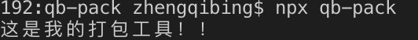

## 创造一个自己的webpack

###### 这也是我看网上的课边看边学，然后记录一下的

##### 起步 增加命令

执行webpack的指令是npx webpack，而我们创造一个自己的webpack的话就需要一个自己专属的指令，而我的就叫qb-pack。

先执行==npm init==初始化package.json，然后在json中增加一个bin的属性，属性名就是我们的指令的名字，而值就是我们运行指令时候的入口文件。like this：

```
{
  "name": "qb-pack",
  "version": "1.0.0",
  "description": "",
  "main": "index.js",
  "author": "",
  "license": "ISC",
  "bin": {
    "qb-pack": "./bin/qb-pack.js"
  }
}

```

其中bin下面的那个属性值就是我们入口文件的路径，然后我们就在该目录下创建文件，我这个文件是在和package.json同级的目录下创建了bin文件夹，里面创建了我自己想要的入口文件。然后在入口文件中写上
```
console.log("这是我的打包工具！！！");
```

然后在package.json的路径下执行==npm link==，这个类似于将你的命名挂载到全局上，这样就可以在别的项目中使用你的打包工具了。执行了==npm link==以后，如果成功就会出现这样的字
```
/usr/local/bin/qb-pack -> /usr/local/lib/node_modules/qb-pack/bin/qb-pack.js
/usr/local/lib/node_modules/qb-pack -> /Users/zhengqibing/Documents/test/webpack/qb-pack

```
我这是在Mac上运行的，Windows上的意思应该和Mac上是一样的，第一句话应该是将js的文件指向我自己创建这个文件，第二句话应该是将package.json文件指向自己创建的这个json文件，现在你就可以运行你的命令了，随便打开一个终端，然后输入==npx qb-pack==，然后就能在控制台看到你所打印的东西了。



这样第一步就大功告成啦。